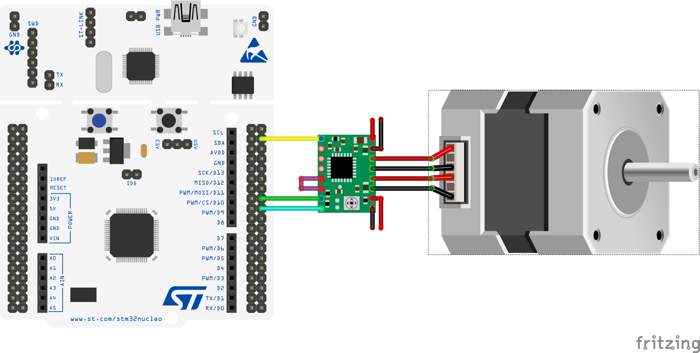

# Base Mbed OS driver for DRV8825/A4988 like stepper motor controllers

This library is inspired by arduino [AccelStepper](https://www.airspayce.com/mikem/arduino/AccelStepper/index.html)
library, but unlike it uses timer interrupts to execute steps.

The library has summary speed limit for all stepper motors as since some threshold an interrupt processing takes 100% of
CPU time.

MCU with 84 MHz cortex M4 core (like SMT32F401) gives the following approximate limits:

- mbed-os "debug" profile: 30000 steps per second
- mbed-os "release" profile: 100000 steps per second

### Movement modes

- Constant speed mode. In this mode library trigger steps with a constant interval.
- Constant acceleration mode. In this mode library tracks current speed and limit maximal acceleration. It allows
  reaching smooth movement and higher speed than constant speed mode.
- Custom step mode. In this mode external code defines custom function to calculate an interval between steps.

Examples of different modes usage can be found in `examples` folder.

### Supported stepper motors

Currently, library contains only implementation for stepper motor with A4988/DRV8825 controller IC or compatible chips.

### Mbed OS version support

| Mbed OS | status |
|---|---|
| 6.5 | Compiles and runs ok |
